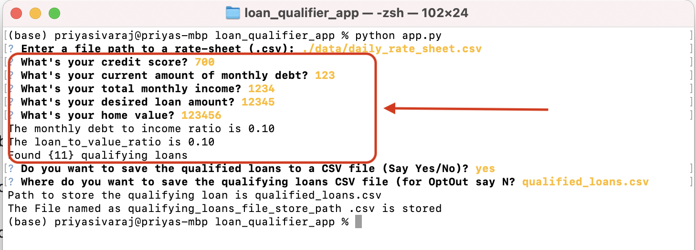

# Loan Qualifier App

This app prompts the user for certain financial data in order to see which banks will be able to provide a loan to the user. After the user inputs all the necessary data, the app will then prompt the user if they want to save their qualifying loans as CSV file. The user can then enter the path of where they want to save the file if they choose to do so.

---

## Technologies

**Python 3.7.9** was used to code this application. The Python libararies used to make this app are: **Fire, Questionary, CSV, Pathlib, and Sys.**

---

## Installation Guide

To use this app, just download the **Starter_code2** folder , and use the Terminal to opent he **app.py** file in python. To run the app, enter
> python app.py
> 


---

## Usage

Run the app by typing in **python app.py** and it will prompt you enter the path for CSV file containing the loans, which is **data/daily_rate_sheet.csv:**
Code block that questionary is used for finding the qaulified load list and store it in csv file.


---
Enter in the requested financial data and you will see the debt to **income ratio, loan to value ratio**, and the **number of qualifying loans:**



---
Then enter either **y or n** to save the qualifying loans as a CSV file. If you choose **not** to save the file, then the app will automatically exit. If you move forward to saying, then you must enter the path of where you want to save the file:


---
```
def save_qualifying_loans(qualifying_loans):
    """Saves the qualifying loans to a CSV file.

    Args:
        qualifying_loans (list of lists): The qualifying bank loans.
    """

    # @TODO: Complete the usability dialog for savings the CSV Files.
    if len(qualifying_loans) == 0:
        print ("Bummer! No Qualifying loans found in the list based on the criteria given. \n Thank you for using this app.")
    else:
        want_to_save_csvfile = str(questionary.text("Do you want to save the qualified loans to a CSV file (Say Yes/No)?").ask())
        #print ("You said " + want_to_save_csvfile )
        if want_to_save_csvfile.lower() == "no" or want_to_save_csvfile.lower() == "n" :
            print ("Thank you for using this app")
        else:
            qualifying_loans_file_store_path = questionary.text("Where do you want to save the qualifying loans CSV file (for OptOut say N?").ask()
            if qualifying_loans_file_store_path == "N":
                print ("Ok! Your wish is my command!. Not saving the file. \n Thank you for using this app")
            else:
                print ("Path to store the qualifying loan is " + qualifying_loans_file_store_path )
                #TODO CSVWRITER and write the qualifying loans list to the file path provided in qualifying_loans_file_store_path
                #Set the output header
                header = ["Lender", "Max Loan Amount", "Max LTV", "Max DTI", "Min Credit Score", "Interest Rate"]
                with open(qualifying_loans_file_store_path, 'w') as xyz:
                    csvwriter = csv.writer(xyz)
                    csvwriter.writerow(header)
                    for x in qualifying_loans:
                        #print (x)
                        csvwriter.writerow(x)
                    print ("The File named as qualifying_loans_file_store_path .csv is stored")
```


---

## Contributors

Solely developed by Priya Sukumaran with help from Google.

---

## License

Anyone wants to use this code base for trials, please do so.
